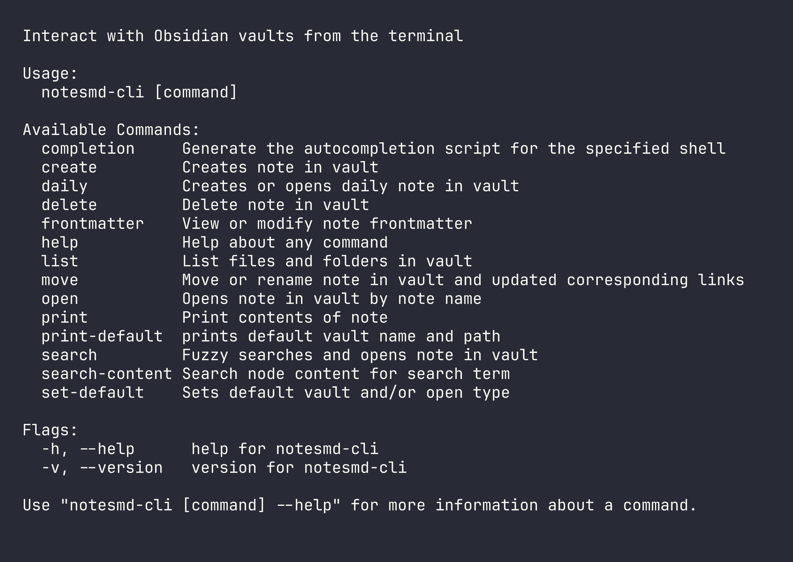

# NotesMD CLI

> **Note**: With the release of the official Obsidian CLI., this project has been renamed from "Obsidian CLI" to "NotesMD CLI" to avoid confusion. NotesMD CLI works **without requiring Obsidian to be running**, making it perfect for scripting, automation, and terminal-only environments.

---

## 

## Description

Obsidian is a powerful and extensible knowledge base application
that works on top of your local folder of plain text notes. This CLI tool (written in Go) will let you interact with the application using the terminal. You are currently able to open, search, list, move, create, update and delete notes.

---

## Install

### Windows

You will need to have [Scoop](https://scoop.sh/) installed. On powershell run:

```
scoop bucket add scoop-yakitrak https://github.com/yakitrak/scoop-yakitrak.git
```

```
scoop install notesmd-cli
```

### Mac and Linux

You will need to have [Homebrew](https://brew.sh/) installed.

```Bash
brew tap yakitrak/yakitrak
```

```Bash
brew install yakitrak/yakitrak/notesmd-cli
```

### Arch Linux (AUR)

Install the offical binary with your preferred AUR helper:
```sh
yay -S notesmd-cli-bin
```

Or build from source:
```sh
yay -S notesmd-cli
```

### Build from Source

Requires [Go](https://go.dev/dl/) 1.19 or later.

```bash
git clone https://github.com/yakitrak/notesmd-cli.git
cd notesmd-cli
go build -o notesmd-cli .
sudo install -m 755 notesmd-cli /usr/local/bin/
```

### Headless / No Obsidian Installed 

If you're running on a headless server or don't have Obsidian installed (e.g., server environments, containers, or systems without a GUI), you can still use this CLI. Obsidian requires a GUI, so this section explains how to set up the required configuration manually.

**Setup Instructions:**

1. Create the Obsidian config directory:
   ```bash
   mkdir -p ~/.config/obsidian
   ```

2. Create `obsidian.json` with your vault configuration:
   ```json
   {
     "vaults": {
       "your-vault-name": {
         "path": "/path/to/your/vault"
       }
     }
   }
   ```
   Replace `your-vault-name` with whatever name you want to use. For the path, use the **absolute path** — do not use `~` as the CLI does not expand it to your home directory.

---

## Migrating from Obsidian CLI

**Upgrading from `obsidian-cli` v0.2.3 or earlier?** See the detailed [Migration Guide](MIGRATION.md) for step-by-step instructions on uninstalling the old version, installing Vault CLI, and migrating your configuration.

## Usage

### Help

```bash
# See All command instructions
notesmd-cli --help
```

### Editor Flag

The `open`, `daily`, `search`, `search-content`, `create`, and `move` commands support the `--editor` (or `-e`) flag, which opens notes in your default text editor instead of the Obsidian application. This is useful for quick edits or when working in a terminal-only environment.

The editor is determined by the `EDITOR` environment variable (e.g., `"vim"`, `"code"`, or `"code -w"`). If not set, it defaults to `vim`.

**Supported editors:**

- Terminal editors: vim, nano, emacs, etc.
- GUI editors with wait flag: VSCode (`code`), Sublime Text (`subl`), Atom, TextMate
  - The CLI automatically adds the `--wait` flag for supported GUI editors to ensure they block until you close the file

**Example:**

```bash
# Set your preferred editor (add to ~/.zshrc or ~/.bashrc to make permanent)
export EDITOR="code"  # or "vim", "nano", "subl", etc.

# Use with supported commands
notesmd-cli open "note.md" --editor
notesmd-cli daily --editor
notesmd-cli search --editor
notesmd-cli search-content "term" --editor
notesmd-cli create "note.md" --open --editor
notesmd-cli move "old.md" "new.md" --open --editor
```

To avoid passing `--editor` every time, configure it as the default open type once:

```bash
notesmd-cli set-default --open-type editor
```

### Set Default Vault and Open Type

Defines the default vault and/or open type for future usage. If no default vault is set, pass the `--vault` flag with other commands.

```bash
# Set default vault (vault name only, not the path)
notesmd-cli set-default "{vault-name}"

# Set default open type: 'obsidian' (default) or 'editor'
notesmd-cli set-default --open-type editor

# Set both at once
notesmd-cli set-default "{vault-name}" --open-type editor
```

When `default_open_type` is set to `editor`, commands that support `--open` will open notes in `$EDITOR` automatically, without needing to pass `--editor` each time.

Note: `open` and other commands in `notesmd-cli` use this vault's base directory as the working directory, not the current working directory of your terminal.

### Print Default Vault

Prints default vault and path. Please set this with `set-default` command if not set.

```bash
# print the default vault name and path
notesmd-cli print-default

# print only the vault path
notesmd-cli print-default --path-only
```

You can add this to your shell configuration file (like `~/.zshrc`) to quickly navigate to the default vault:

```bash
obs_cd() {
    local result=$(notesmd-cli print-default --path-only)
    [ -n "$result" ] && cd -- "$result"
}
```

Then you can use `obs_cd` to navigate to the default vault directory within your terminal.

### Open Note

Open given note name in Obsidian (or your default editor). Note can also be an absolute path from top level of vault.

```bash
# Opens note in obsidian vault
notesmd-cli open "{note-name}"

# Opens note in specified obsidian vault
notesmd-cli open "{note-name}" --vault "{vault-name}"

# Opens note at a specific heading (case-sensitive)
notesmd-cli open "{note-name}" --section "{heading-text}"

notesmd-cli open "{note-name}" --vault "{vault-name}" --section "{heading-text}"

# Opens note in your default editor instead of Obsidian
notesmd-cli open "{note-name}" --editor
```

### Daily Note

Creates or opens today's daily note directly on disk — **Obsidian does not need to be running**. If `.obsidian/daily-notes.json` exists in the vault, the CLI reads `folder`, `format` (Moment.js date format, default `YYYY-MM-DD`), and `template` from it. A template file's content is used when creating a new daily note. If the config is missing or unreadable, defaults are used (vault root, `YYYY-MM-DD`, no template).

```bash
# Creates / opens daily note in obsidian vault
notesmd-cli daily

# Creates / opens daily note in specified obsidian vault
notesmd-cli daily --vault "{vault-name}"

# Creates / opens daily note in your default editor
notesmd-cli daily --editor
```

### Search Note

Starts a fuzzy search displaying notes in the terminal from the vault. You can hit enter on a note to open that in Obsidian.

```bash
# Searches in default obsidian vault
notesmd-cli search

# Searches in specified obsidian vault
notesmd-cli search --vault "{vault-name}"

# Searches and opens selected note in your default editor
notesmd-cli search --editor

```

### Search Note Content

Searches for notes containing search term in the content of notes. It will display a list of matching notes with the line number and a snippet of the matching line. You can hit enter on a note to open that in Obsidian.

```bash
# Searches for content in default obsidian vault
notesmd-cli search-content "search term"

# Searches for content in specified obsidian vault
notesmd-cli search-content "search term" --vault "{vault-name}"

# Searches and opens selected note in your default editor
notesmd-cli search-content "search term" --editor

```

### List Vault Contents

Lists files and folders in a vault path. If no path is provided, it lists the vault root.

```bash
# Lists vault root
notesmd-cli list

# Lists contents of a subfolder in default vault
notesmd-cli list "001 Notes"

# Lists contents of a subfolder in specified vault
notesmd-cli list "001 Notes" --vault "{vault-name}"

```

### Print Note

Prints the contents of given note name or path in Obsidian.

```bash
# Prints note in default vault
notesmd-cli print "{note-name}"

# Prints note by path in default vault
notesmd-cli print "{note-path}"

# Prints note in specified obsidian
notesmd-cli print "{note-name}" --vault "{vault-name}"

```

### Create / Update Note

Creates a note (can also be a path with name) directly on disk — **Obsidian does not need to be running**. If the note already exists and neither `--overwrite` nor `--append` is passed, the file is left unchanged. Intermediate directories are created automatically.

When the note name has no explicit path (no `/`), the CLI reads `.obsidian/app.json` from the vault to check for a configured default folder (`newFileLocation: "folder"` and `newFileFolderPath`). If configured, the note is placed in that folder. If the config is missing or unreadable, the note is created at the vault root.

```bash
# Creates empty note in default vault
notesmd-cli create "{note-name}"

# Creates empty note in specified vault
notesmd-cli create "{note-name}" --vault "{vault-name}"

# Creates note with content
notesmd-cli create "{note-name}" --content "abcde"

# Overwrites an existing note
notesmd-cli create "{note-name}" --content "abcde" --overwrite

# Appends to an existing note
notesmd-cli create "{note-name}" --content "abcde" --append

# Creates note and opens it in Obsidian
notesmd-cli create "{note-name}" --content "abcde" --open

# Creates note and opens it in your default editor
notesmd-cli create "{note-name}" --content "abcde" --open --editor

```

### Move / Rename Note

Moves a given note(path from top level of vault) with new name given (top level of vault). If given same path but different name then its treated as a rename. All links inside vault are updated to match new name.

```bash
# Renames a note in default obsidian
notesmd-cli move "{current-note-path}" "{new-note-path}"

# Renames a note and given obsidian
notesmd-cli move "{current-note-path}" "{new-note-path}" --vault "{vault-name}"

# Renames a note in default obsidian and opens it
notesmd-cli move "{current-note-path}" "{new-note-path}" --open

# Renames a note and opens it in your default editor
notesmd-cli move "{current-note-path}" "{new-note-path}" --open --editor
```

### Delete Note

Deletes a given note (path from top level of vault).

```bash
# Renames a note in default obsidian
notesmd-cli delete "{note-path}"

# Renames a note in given obsidian
notesmd-cli delete "{note-path}" --vault "{vault-name}"
```

### Frontmatter

View and modify YAML frontmatter in notes. Alias: `fm`

```bash
# Print frontmatter of a note
notesmd-cli frontmatter "{note-name}" --print

# Edit a frontmatter field (creates field if it doesn't exist)
notesmd-cli frontmatter "{note-name}" --edit --key "status" --value "done"

# Delete a frontmatter field
notesmd-cli frontmatter "{note-name}" --delete --key "draft"

# Use with a specific vault
notesmd-cli frontmatter "{note-name}" --print --vault "{vault-name}"
```

## Excluded Files

The CLI respects Obsidian's **Excluded Files** setting (`Settings → Files & Links → Excluded Files`).

- `search` — excluded notes won't appear in the fuzzy finder
- `search-content` — excluded folders won't be searched

All other commands (`open`, `move`, `print`, `frontmatter`, etc.) still access excluded files as they refer to notes by name.

## Contribution

Fork the project, add your feature or fix and submit a pull request. You can also open an [issue](https://github.com/yakitrak/notesmd-cli/issues/new/choose) to report a bug or request a feature.

## License

Available under [MIT License](./LICENSE)
